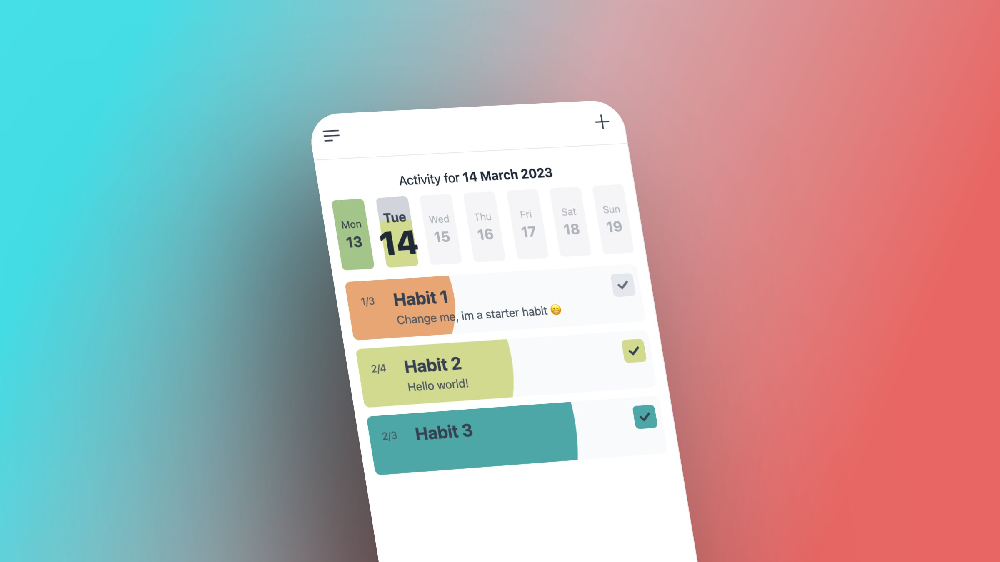
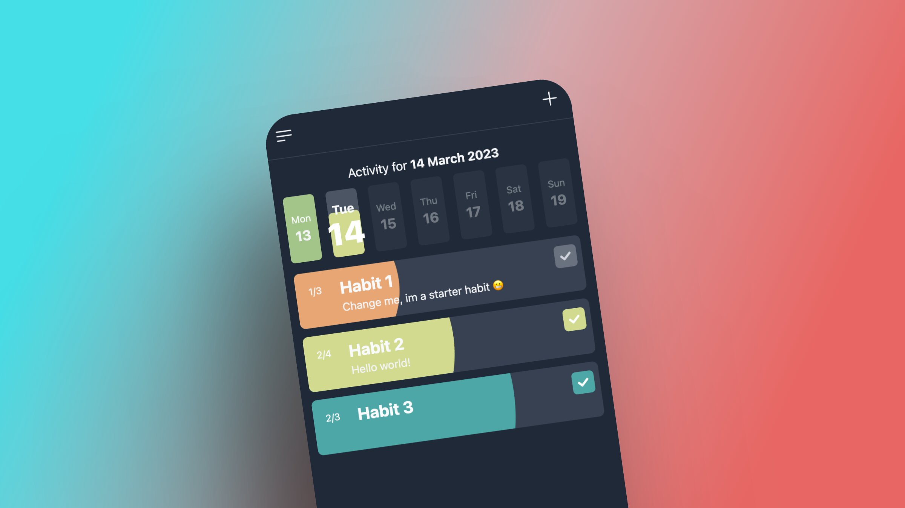

# Habitly

## A minimal habit tracking app

[PROJECT PREVIEW](https://habitly.netlify.app/)

I started this project for a number of reasons:

1. I didn't find one habit tracking app on the market that met my personal needs
2. Never built a PWA before (perfect learning opportunity)
3. Had some spare time on the job, so wanted to use that time wisely
4. Wanted to build something in public, so people can follow along.

The tech under the hood:

- React
- Typescript
- Tailwind css
- Framer motion
- Dexie (for storing persistent data in a indexedDB database)
- Date-fns

What it can do:

- All habits are tracked in the current ongoing week
- User ticks off habits by day until you reach your weekly quota (or you go overboard 💪)
- User can customize a habit (title, description, color, and frequency in a week)
- User can see a monthly overview of when he has completed habits in the past and some basic stats (total % of completion, total missed habits, and so on)
- User can re-order habits
- User can pick Monday or Sunday as the starting day of the week
- Also Light/Dark theme are there as well
- Its a PWA so it can be installed to a mobile devices homescreen
- All data is saved in the browsers indexedDB so this app does not need an internet connection at all

TODO:

- [x] Import/Export of habits
- [x] Archive habits
- [ ] Add todo lists for individual habits
- [ ] Figure out how to implement reminders (not sure if possible in a totally offline PWA)
      Maybe at some point add a server to handle that
- [x] Option to trash all habits
